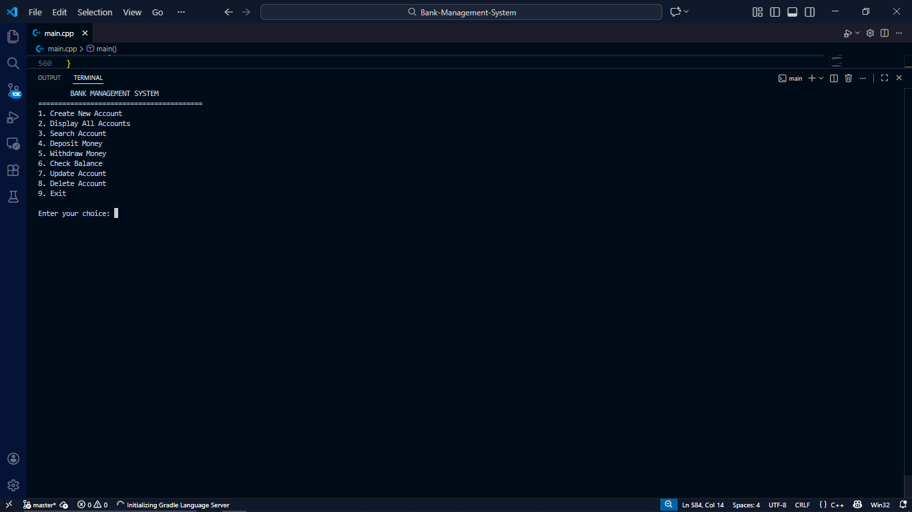
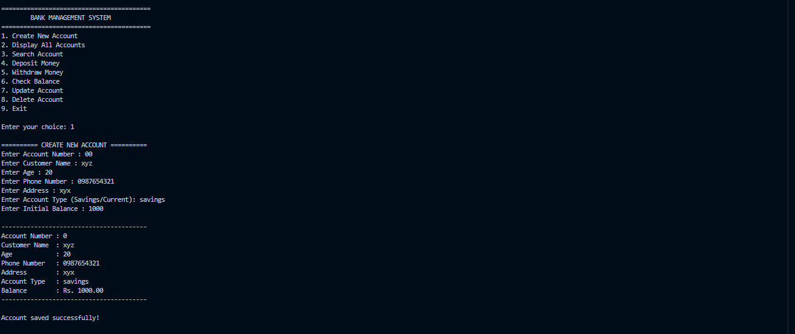
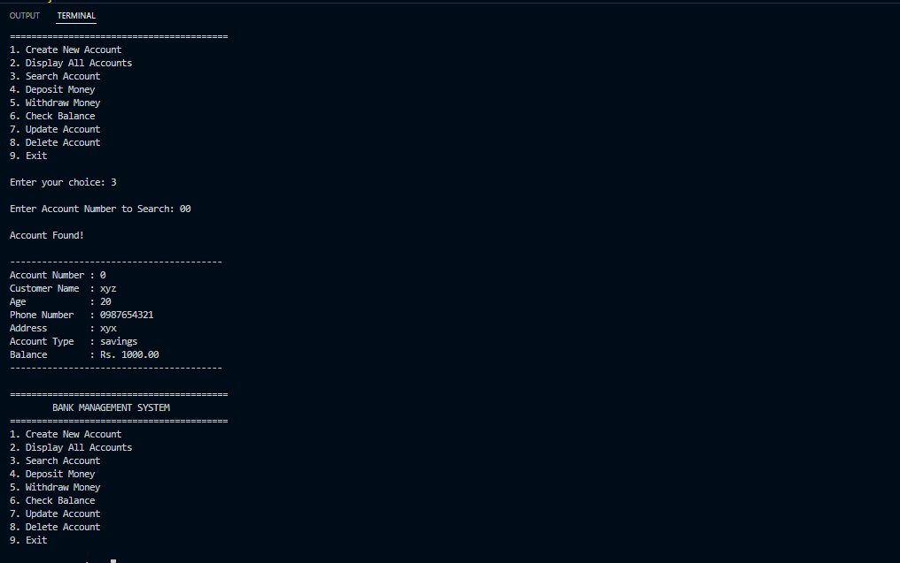
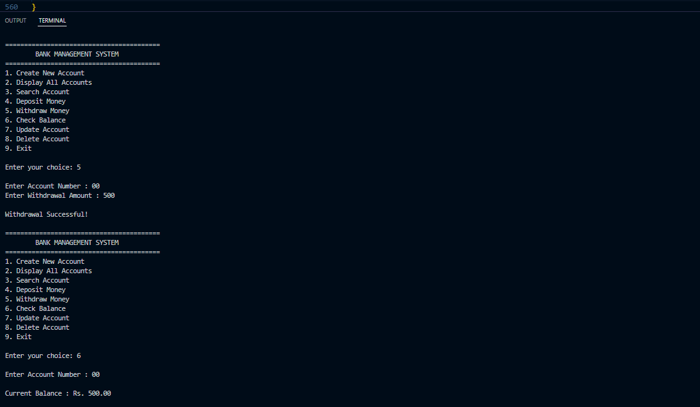

 
# 🏦 Bank Management System

A console-based **Bank Management System** developed in **C++** using **Object-Oriented Programming (OOP)** and **File Handling**. The application allows users to securely manage bank accounts with persistent data storage, making it a practical demonstration of core C++ programming concepts.


---

## 📌 Project Overview

This project simulates the basic operations of a banking system through a menu-driven console application. Customer information is stored in a text file, allowing account data to persist even after the program is closed.

The project was developed as part of the **Thiranex C++ Internship Program** to strengthen concepts such as classes, file handling, vectors, string streams, and CRUD operations.

---
## 📑 Table of Contents

- 📌 Project Overview
- ✨ Features
- 🛠 Technologies Used
- 📂 Project Structure
- ⚙️ How It Works
- 🚀 Getting Started
- 📸 Screenshots
- 📖 Concepts Demonstrated
- 🎯 Future Improvements
- 📚 Learning Outcomes
- 📊 Project Status
- 👨‍💻 Author
---
## ✨ Features

- [x] Create Account
- [x] Display Accounts
- [x] Search Account
- [x] Deposit Money
- [x] Withdraw Money
- [x] Check Balance
- [x] Update Account
- [x] Delete Account
- [x] Persistent File Storage
---

## 🛠️ Technologies Used

| Technology | Purpose |
|------------|---------|
| C++ | Programming Language |
| Object-Oriented Programming | Data Management |
| File Handling | Persistent Storage |
| STL Vector | Temporary Data Storage |
| StringStream | Parsing File Data |
| VS Code | Development Environment |
| GCC (MSYS2 MinGW) | Compiler |
| Git & GitHub | Version Control |

---

## 📂 Project Structure

```text
Bank-Management-System/
│
├── screenshots/
│   ├── home.png
│   ├── create.png
│   ├── search.png
│   └── transactions.png
│
├── accounts.txt
├── main.cpp
├── .gitignore
└── README.md
```

---

## ⚙️ How It Works

Each account contains the following information:

- Account Number
- Customer Name
- Age
- Phone Number
- Address
- Account Type
- Current Balance

The application stores account information in:

```text
accounts.txt
```
acconts.txt will generates automatically when data is given 

using a pipe-separated format:

```text
101|Vinay|20|9876543210|Nuzvid|Savings|50000
```

---

## 🚀 Getting Started

### Clone the Repository

```bash
git clone https://github.com/karrivinay54/Bank-Management-System.git
```

### Navigate to the Project

```bash
cd Bank-Management-System
```

### Compile

```bash
g++ main.cpp -o main
```

### Run

**Windows**

```bash
./main.exe
```

**Linux/macOS**

```bash
./main
```

---

## 📸 Screenshots

### 🏠 Main Menu



---

### ➕ Create Account



---

### 🔍 Search Account



---

### 💰 Banking Operations



---

## 📖 Concepts Demonstrated

- Object-Oriented Programming
- Classes and Objects
- Constructors
- File Handling
- CRUD Operations
- Vectors
- String Streams
- Functions
- Menu-Driven Programming
- Data Persistence

---

## 🎯 Future Improvements

- Input Validation
- Duplicate Account Detection
- Transaction History
- Fund Transfer
- Password Protection
- Binary File Storage
- Database (MySQL)
- GUI using Qt
---

## 📚 What I Learned

During this project, I gained practical experience with:

- Designing menu-driven applications
- Managing structured data using classes
- Reading and writing files
- Parsing text files using `stringstream`
- Updating records using vectors
- Applying CRUD operations in C++
- Managing project versions using Git and publishing projects on GitHub

---

## 📊 Project Status

- ✅ Status: Completed
- 🏷️ Version: v1.0.0
- 💻 Language: C++
- 🧩 Paradigm: Object-Oriented Programming
- 💾 Storage: Text File (Persistent)
- 📅 Last Updated: July 2026

---

## 👨‍💻 Author
 
**Karri Vinay**

B.Tech – Electronics & Communication Engineering  
RGUKT IIIT Nuzvid

GitHub: https://github.com/karrivinay54

LinkedIn:
https://www.linkedin.com/in/karri-vinay

---

## ⭐ If you found this project helpful

Consider giving the repository a ⭐ on GitHub.


---

> This project was developed incrementally while learning C++, Object-Oriented Programming, File Handling, and Git. Each feature was implemented, tested, and committed separately to build a structured development history.
